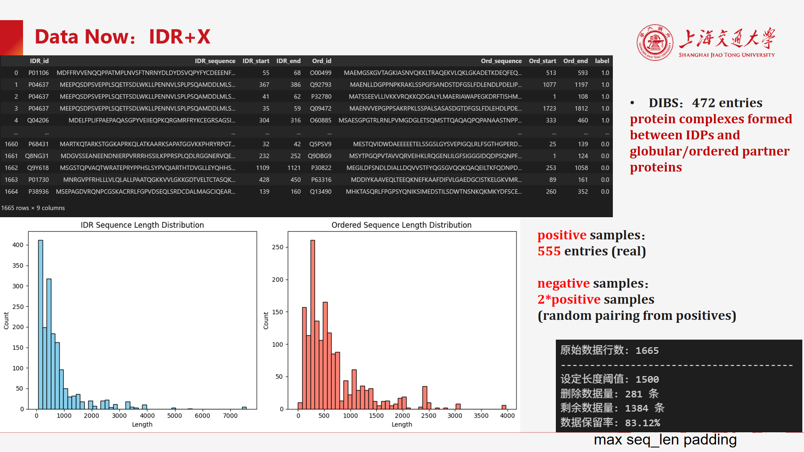
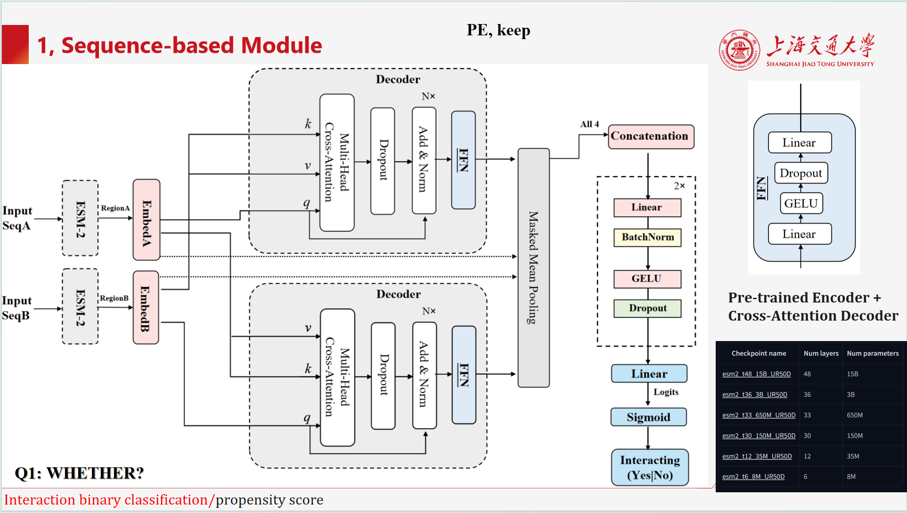
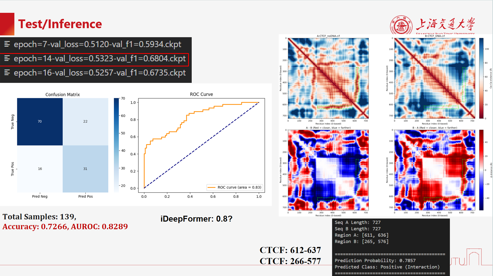
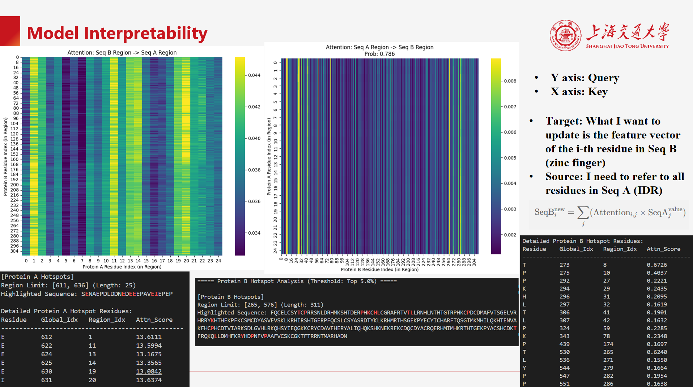

# IDRInter_seq

## Dataset

DIBS数据库: IDP + 有序复合物结构, 包含IDP链片段和目标链片段的接触信息(坐标)等结构特征(正样本).

负样本: DIBS每一行pairing是正样本, 在row之间随机配对作为负样本, 保持比例1:1

## Task

输入两条序列, 其中一条是IDP(包含有IDR区域), 另一条是有序蛋白, 给出每条序列聚焦区域的坐标, 预测这两条序列在 区域片段level上是否会发生互作, 也就是判断这两条序列在 区域片段level上是否存在接触. （二分类任务, 输出为0或1, 或者原始输出logits为互作概率）

## Model architecture

ESM-2大语言模型作为预训练的encoder, 生成IDP和有序蛋白的embedding, 然后对聚焦区域截取embedding.

再进行双塔的交叉注意力机制, 生成IDP和有序蛋白的交互表示.

将原始A/B区域的embedding, 和交叉注意交互之后的A/B区域的embedding, 进行拼接(4个embedding), 再输入线性层(MLP), 

输出二分类的互作预测结果(logits 与0.5比较).

## Training

详细config配置见 `configs/IDRinter_seq_model.yaml`

Torch V2.9.1 + CUDA 13.0, RTX 4080 16GB 下训练完成, 耗时约1天左右(因为训练数据集只有几百条)

checkpoint未上传, 但可以重新训练得到

## 测试与推理

生物学可解释性, 从注意力机制的attention heatmap中理解

